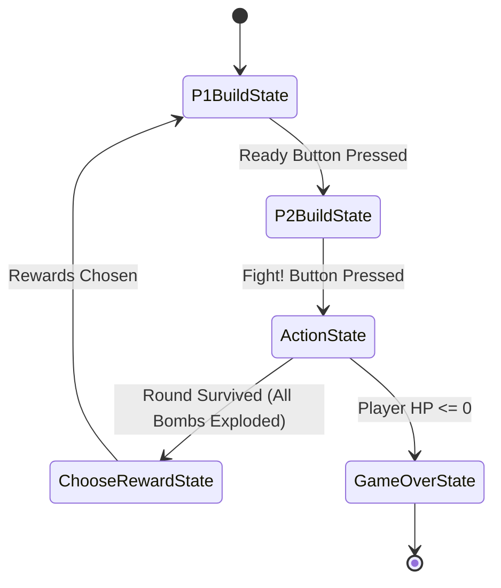

# PPT Slide Presentation Report: Skyward Defense

This document compiles all the required information, architecture summaries, and code snippets to construct a high-quality PowerPoint presentation for the **Skyward Defense** OOP project.

---

## 🖥️ Slide 1: Cover Page

### Content
*   **Project Title**: Skyward Defense: OOP Tactical Base Builder
*   **Course**: Object-Oriented Programming (OOP) Project
*   **Team Members**: 
    *   *[Insert Name 1]* (Role: Lead Systems Architect / Core Physics & Game Loop)
    *   *[Insert Name 2]* (Role: UI/UX & Firebase Backend Integration)
    *   *Add Member Photos Here*
*   **Visual Style**: Sleek Dark Theme (matching the HSL dark palette of the game interface) with blue/cyan neon grid lines representing tactical grid structures.

---

## 📌 Slide 2: Introduction

### Project Overview
*   **Skyward Defense** is a physics-based, hybrid HTML5 tactical defense game.
*   The game features a dual experience:
    1.  **Single Player Campaign**: Construct structural barriers, defensive pillboxes, and target-seeking mortars to shield a player character from incoming bombing runs.
    2.  **1v1 Local Multiplayer Mode**: Turn-based grid building where two players build bases on their respective screen halves and launch ballistic weapons at each other.
*   Uses a robust dual-layer UI architecture integrating native HTML5/CSS shells for screens/menus and a **Phaser 3** engine canvas with **Matter.js** physics for gameplay.

### Purpose and Objectives
*   Demonstrate core **OOP concepts** (Encapsulation, Inheritance, Polymorphism) in JavaScript.
*   Apply **Gang of Four (GoF) Design Patterns** (Factory Method, Template Method, State, Command) to handle physics interactions, asset instantiation, and turn-based state machines.
*   Ensure complete **decoupling** of game logic, audio managers, visual presentation, and database persistence.

---

## 🏗️ Slide 3: Object-Oriented Design (Core OOP Concepts)

### 1. Encapsulation
*   Managers encapsulate complex processes to hide internal mechanics from the rest of the application.
*   *Examples*:
    *   [BuildingManager](core/buildingManager.js): Manages inventory calculations, drag-and-drop placement constraints, and building validation rules.
    *   [SfxManager](core/sfxManager.js): Hides volume settings, audio pools, and play configurations.

### 2. Inheritance
*   Classes inherit from base modules to reuse and standardize functionality.
*   *Examples*:
    *   All scenes (e.g. [GameScene](scenes/gameScene.js), [Game1v1Scene](scenes/game1v1Scene.js)) extend `Phaser.Scene`.
    *   Specific object creator classes extend `BaseObjectCreator` to handle distinct placement configurations.

### 3. Polymorphism
*   Overriding interface methods allows different classes to respond differently to the same call.
*   *Examples*:
    *   Creators (`PlaceableCreator`, `LevelObjectCreator`, `InternalObjectCreator`) override hooks like `getConfig()` and `decorateProperties()`.
    *   `Game1v1State` subclasses (`P1BuildState`, `ActionState`, etc.) implement their own distinct behavior for `.enter()`, `.exit()`, and `.update()`.

---

## 🎨 Slide 4: GoF Design Patterns Applied

### 1. Template Method & Factory Method (Object Creation)
The creation of game assets is streamlined via a unified creation pipeline. The base creator defines the workflow (Template Method), while individual creators define concrete parameters (Factory Method).

*   **Location**: [factories/objectFactory.js](factories/objectFactory.js)

```javascript
// Base Template Class
class BaseObjectCreator {
  create(scene, type, x, y, arena, options = {}) {
    const cfg = this.getConfig(type, options); // Subclass Hook (Factory Method)
    const dims = _computeSize(scene, cfg);
    const { bodyW, bodyH, scaleX, scaleY } = dims;
    const obj = _buildVisual(scene, cfg, x, y, bodyW, bodyH, scaleX, scaleY);

    if (this.shouldAttachPhysics(cfg)) {
      _addPhysics(scene, obj, cfg, bodyW, bodyH, dims);
    }
    
    this.decorateProperties(obj, type, cfg, options); // Subclass Hook
    this.register(obj);
    return obj;
  }
}

// Polymorphic Subclass
class PlaceableCreator extends BaseObjectCreator {
  getConfig(type, options) {
    return window.ObjectConfig.placeableTypes[type];
  }

  decorateProperties(obj, type, cfg, options) {
    obj.isBuilding = true;
    obj.isDragging = false;
  }
}
```

---

## ⚔️ Slide 5: GoF Design Patterns Applied (Cont.)

### 2. State Pattern (1v1 Game Flow Management)
The turn-based local 1v1 battle cycle uses a state machine to cleanly transition between P1 building, P2 building, battle action, card upgrades, and game over states.

*   **Location**: [core/game1v1States.js](core/game1v1States.js)



```javascript
class Game1v1State {
  constructor(scene) { this.scene = scene; }
  enter() {}
  exit() {}
  update(time, delta) {}
}

class ActionState extends Game1v1State {
  enter() {
    this.scene.turnText.setText("FIGHT!");
    // Activate structures, mortars, and pillboxes
    this.scene.placedObjects.forEach(obj => {
      if (typeof obj.activate === 'function') obj.activate(target);
    });
  }
  
  update(time, delta) {
    this.scene.handlePlayerMovement();
    this.scene.checkWinCondition();
  }
}
```

---

## 💥 Slide 6: Code Implementation (The Explosion Command)

### Concept
Detonating bombs is a complex process involving multiple steps (SFX playback, VFX throttling, Matter.js querying, knockback calculations, and damage falloff). We encapsulated this logic using the **Command Pattern**.

*   **Location**: [core/explosionCommand.js](core/explosionCommand.js)

```javascript
class ExplosionCommand {
  constructor(scene, options = {}) {
    this.scene = scene;
    this.x = options.x;
    this.y = options.y;
    this.explosiveCfg = options.explosiveCfg;
  }

  execute() {
    const radius = this._blastRadiusPx(this.explosiveCfg.explosion);
    
    // 1. Play SFX & VFX with proximity throttling to prevent performance lag
    window.SfxManager?.playExplosion?.();
    this._spawnExplosionVFX(this.explosiveCfg.explosion, this.x, this.y);

    // 2. Query Matter.js physics engine to find bodies in blast area
    const bodies = this._collectBlastBodies(this.x, this.y, radius);

    // 3. Apply radial knockback and falloff-based damage
    for (const body of bodies) {
      this._applyBlastEffects(body, this.x, this.y, radius, 
                              this.explosiveCfg.blastForce, 
                              this.explosiveCfg.blastMaxDamage);
    }
  }
}
```

---

## 🛠️ Slide 7: Technical Challenges & Solutions

### 1. Physics-to-Visual Synchronization
*   *Challenge*: Bouncing items off slanted trampolines requires calculating high-fidelity angles, mirroring velocity vectors, and applying correct coefficients of restitution.
*   *Solution*: Overrode standard Matter.js body velocities inside custom bounce callbacks by resolving incoming velocity projections along the trampoline surface normals.

### 2. High-Quantity Collision Throttling
*   *Challenge*: Simultaneous cluster bomb detonations cause massive rendering lag due to hundreds of overlapping animation frames.
*   *Solution*: Implemented an explosion throttling pool in `ExplosionCommand` that skips visual spawning for overlapping events occurring within 40px and 200ms of each other, while still executing damage/physics logic.

---

## 🏁 Slide 8: Conclusion & Future Work

### Technologies Used
*   **Phaser 3**: Core game loop, rendering pipelines, input, and sprite animation management.
*   **Matter.js**: Rigid body physics, vector collisions, friction, gravity, and bounds constraint solver.
*   **Firebase Core**: User authentication (saves shop credits and skin choices) and Firestore DB (Leaderboards).
*   **HTML5 DOM / Vanilla CSS**: Adaptive 16:9 viewport scaling, overlay screen panels, and mobile swipe controls.

### Summary
*   We created a highly responsive tactical base building game.
*   The architecture heavily leverages OOP design principles to make adding new blocks, weapons, or game modes as simple as writing configuration files.

### Future Work
*   **WebRTC Online Multiplayer**: Support online matching instead of local 1v1 split screen.
*   **Level Editor**: Allow players to design custom levels and upload them to Firebase.
*   **Advanced Physics Items**: Introduce ropes, magnets, and sliding platforms.

---

## 📚 Slide 9: References

*   **Phaser 3 Documentation**: [https://phaser.io/learn](https://phaser.io/learn)
*   **Matter.js Physics**: [https://brm.io/matter-js/](https://brm.io/matter-js/)
*   **GoF Design Patterns**: *Design Patterns: Elements of Reusable Object-Oriented Software* (Gamma, Helm, Johnson, Vlissides)
*   **Firebase Integration Tutorial**: [https://firebase.google.com/docs](https://firebase.google.com/docs)
